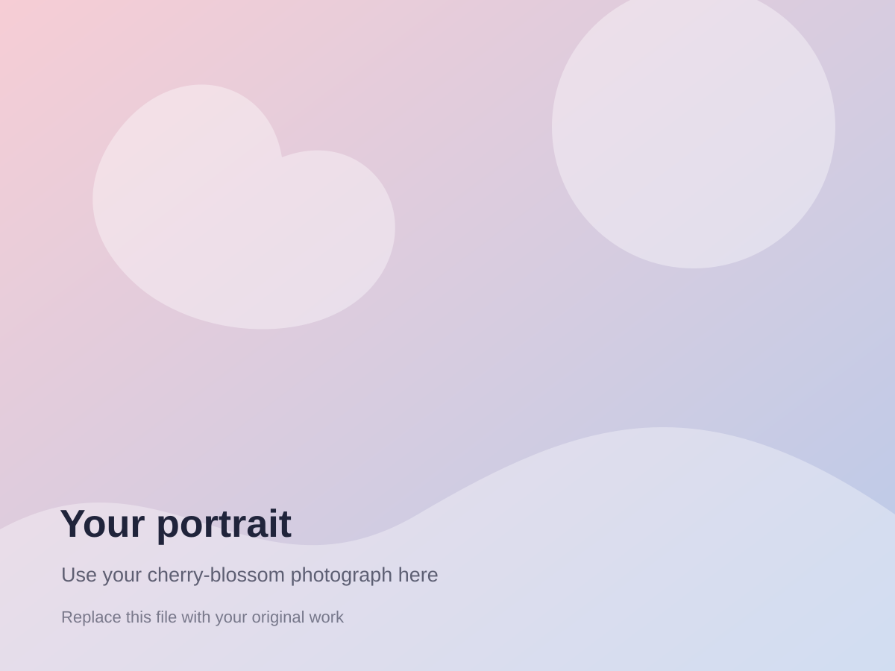
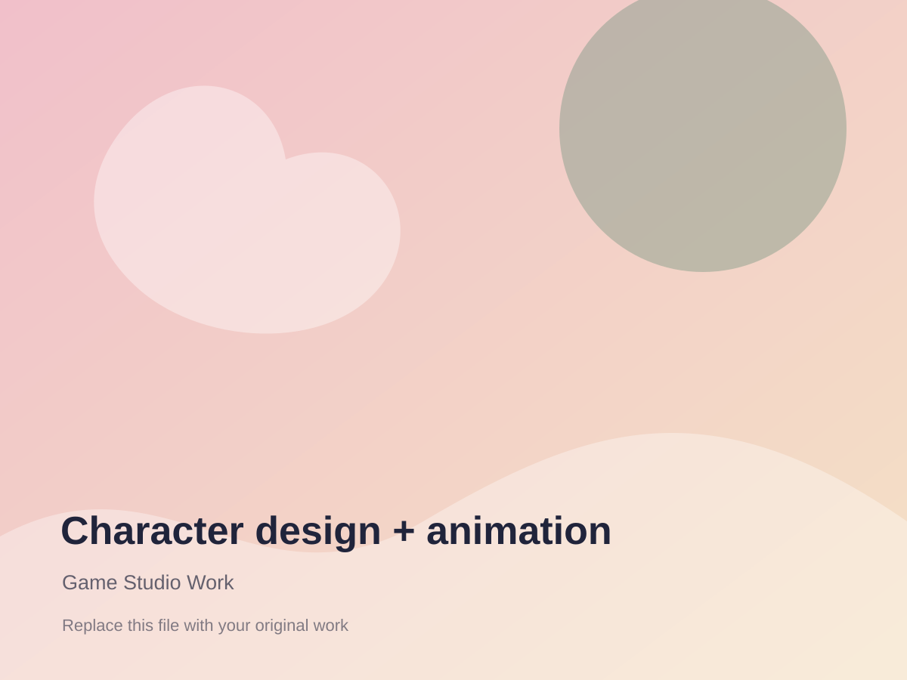

# Angela Chung portfolio — GitHub Pages starter

This is a static HTML/CSS/JavaScript portfolio designed for GitHub Pages. It uses a warm, cherry-blossom-inspired visual style based on the original Wix portfolio, while giving software projects more prominence.

## 1. Preview it on your computer

Opening `index.html` directly works for most of the site. A local server is more reliable:

```bash
cd angela-github-portfolio
python3 -m http.server 8000
```

Visit `http://localhost:8000`.

## 2. Add the files from your computer

### Profile photograph

1. Copy your photograph into `assets/images/`.
2. Name it `profile.jpg` (or use another clear filename).
3. In `index.html`, find:

```html

```

Change it to:

```html

```

Delete the small paragraph beginning with `Replace with` once the real photograph is in place.

### Design images, rendered scenes, and screenshots

Copy the full-resolution files to `assets/images/`. Use lowercase filenames without spaces, for example:

```text
assets/images/
├── minerva-mummy-walk.gif
├── lizard-character.png
├── atlantis-town.jpg
├── robotics-safety-animation.jpg
├── fbla-brochure-01.jpg
└── nature-collage.jpg
```

Then replace a placeholder path in `index.html`:

```html

```

with:

```html

```

For the gallery lightbox, also update the button's `data-lightbox` value:

```html
<button type="button"
        data-lightbox="assets/images/minerva-mummy-walk.gif"
        data-caption="Mummy walk cycle — Minerva Game Studio">
```

### Multiple images for one project

The simplest option is to duplicate a complete `<figure class="gallery-item">...</figure>` block, then update its image, caption, and alt text. You can also create a longer project page later.

### Videos

For a short silent animation, export an optimized `.mp4` and use:

```html
<video controls muted playsinline poster="assets/images/robotics-poster.jpg">
  <source src="assets/images/robotics-safety-animation.mp4" type="video/mp4">
  Your browser does not support embedded video.
</video>
```

Large videos can make the repository slow. YouTube or Vimeo embeds are better for long videos:

```html
<iframe
  src="https://www.youtube.com/embed/VIDEO_ID"
  title="Robotics safety animation"
  loading="lazy"
  allowfullscreen>
</iframe>
```

### PDFs and résumé

Put PDFs in `assets/documents/`, then link to them:

```html
<a href="assets/documents/Angela_Chung_Resume.pdf">Résumé</a>
```

The template already expects that résumé filename. Add your current PDF there or change the link.

## 3. Edit the software projects

The template includes these starter entries based on your work:

- Sprout Motion Tracking
- Visual-Spatial Reasoning in Vision-Language Models
- Atlantis Graphics Town
- MiniSpark Parallel Execution Engine
- Unix Shell with Pipelines
- xv6 Huge-Page Memory Support
- MiniRel storage components

Review every description and date before publishing. Replace placeholder links with the real repository, demo, research report, or video URL.

A repository link looks like:

```html
<a href="https://github.com/YOUR-USERNAME/REPOSITORY"
   target="_blank" rel="noreferrer">
  View repository <span aria-hidden="true">↗</span>
</a>
```

To remove a project, delete its complete `<article class="project-card ...">...</article>` block.

To add a new software project, duplicate a project-card block and change:

- category and year in `.project-meta`
- project title
- description
- technologies in `.tag-list`
- repository/demo links
- decorative project-art class

The decorative art is CSS, so real project screenshots are optional. To use a screenshot instead, replace the `<div class="project-art ...">...</div>` with:

```html
<div class="project-art">
  
</div>
```

Then add this to `styles.css`:

```css
.project-art img {
  height: 100%;
  object-fit: cover;
}
```

## 4. Replace contact information

Search `index.html` for:

```text
YOUR_EMAIL@example.com
YOUR-LINKEDIN
YOUR-USERNAME
```

Replace them with your current professional details. Do not include a street address or phone number unless you intentionally want them public.

## 5. Publish through GitHub Pages

### Personal-site repository

Create a public repository named exactly:

```text
YOUR-USERNAME.github.io
```

Copy all the files inside this folder into that repository's root. `index.html` must be at the top level, not inside another folder.

Then run:

```bash
git add .
git commit -m "Build portfolio site"
git push origin main
```

On GitHub:

1. Open the repository.
2. Select **Settings → Pages**.
3. Under **Build and deployment**, choose **Deploy from a branch**.
4. Select `main` and `/ (root)`.
5. Click the Save button beside those branch settings.
6. Leave **Custom domain** empty.

The site will be available at:

```text
https://YOUR-USERNAME.github.io
```

## 6. Before putting it on your résumé

- Replace every placeholder image and link.
- Add the current résumé PDF.
- Test the site on a phone and laptop.
- Check that images are compressed and load quickly.
- Confirm that each project description clearly states your contribution.
- Remove projects that are weaker or repetitive.
- Avoid publishing private addresses, phone numbers, API keys, datasets, or restricted course code.

## Image-size guidance

- Hero/profile image: roughly 1200 × 1600 px, JPG or WebP
- Gallery images: 1200–1800 px on the longest side
- Screenshots: PNG or WebP
- GIFs: keep them short; MP4 is usually much smaller
- Aim to keep most individual files under 2–4 MB
